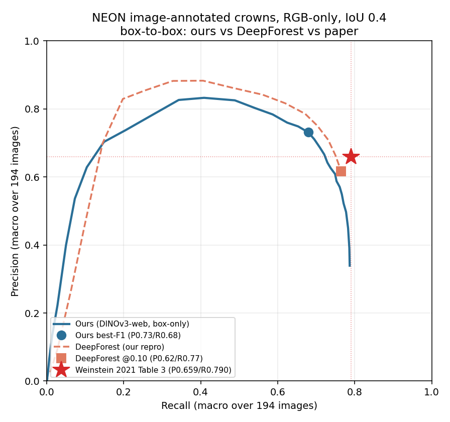

# NEON box-to-box: ours (DINOv3-web, RGB-only) vs DeepForest vs Weinstein 2021

Apples-to-apples individual-tree-crown **detection** on the NeonTreeEvaluation
image-annotated benchmark, IoU 0.4, macro-averaged per image. **Box-to-box**: the EM
box→mask step of our TCD pipeline is excluded. **RGB-only**: no LiDAR/CHM/HSI is loaded,
read, or referenced anywhere (the training zip's LiDAR/CHM/HSI folders were never
extracted — only `RGB/` entries). Compute: Modal **H100** (extract + train + eval on CUDA).
Compute is Modal H100 / CUDA (folder named `modal_neon_multiseed`; the sibling
`../mps_multiseed` is the separate local-MPS TCD experiment).

## Headline (seed 0)

| | Precision | Recall | @ |
|---|---|---|---|
| **Ours** (DINOv3-web frozen + CenterNet, box-only) | **0.731** | **0.680** | best-F1, score_thr 0.28 |
| Ours — max recall achievable | 0.339 | **0.787** | score_thr 0.00 |
| DeepForest 2.1.0 (our reproduction) | 0.617 | 0.765 | score_thr 0.10 |
| **Weinstein 2021 PLOS, Table 3 (target)** | **0.659** | **0.790** | image-annotated RGB |

**Verdict: we do NOT beat the paper (or DeepForest) by the strict dominance test.**
- At the paper's recall (0.790) we can't compete — our recall **ceiling is 0.787**.
- At the paper's precision (0.659) our recall is **0.721 < 0.790**.
- Curve-to-curve, **DeepForest's PR curve dominates ours** at every matched recall from
  0.55–0.75 (e.g. at R=0.68, DF P=0.75 vs ours 0.71).

We occupy a **higher-precision / lower-recall** regime (precision up to 0.83). The gap is
**recall**, consistent with the deliberate RGB-only constraint: DeepForest was pretrained
on **millions of LiDAR-derived** boxes (a recall engine) then fine-tuned on the same
~23k hand-RGB boxes we used; we used the hand-RGB boxes **only**.

 — see [pr_curve_neon.png](pr_curve_neon.png).

## Why recall is limited (per-site, `ours_persite.json`)

Surprising and useful: **zero-shot sites do as well as trained sites** (mean recall
0.698 vs 0.677) — DINOv3-web features generalise across NEON ecosystems, so the limiter
is **not** train/test site mismatch. It's a **model-wide recall ceiling**, worst at
**NIWO (P0.53/R0.34)** — tiny, dense alpine crowns the 8px detector grid can't resolve —
which is heavily weighted (12 of 194 tiles, 1777 boxes). NIWO + a general small-crown
recall gap are the levers (higher eval resolution / an upscale arm; not pursued here).

## Multiscale (upscale arm) A/B — NIWO recall lever

Inference-only 2× **upscale** arm (overlapping 240px quadrants enlarged to fit the 512
pad; cross-scale NMS-merged with native), re-eval of `det_neon_s0.pt` — `neon_modal.py::
eval_multiscale`, `predict_boxes_multiscale`. best-F1 @IoU0.4:

| scope | native P/R (maxR) | +upscale P/R (maxR) |
|---|---|---|
| **NIWO** (12) | 0.534/0.343 (0.348) | **0.465/0.530 (0.701)** |
| SJER (61, sparse) | 0.787/0.690 (0.873) | 0.496/0.684 (0.924) |
| TEAK (51) | 0.724/0.755 (0.810) | 0.612/0.655 (0.905) |
| Global (194) | **0.731/0.680 (0.787)** | 0.523/0.609 (0.886) |

**Confirms the NIWO ceiling is resolution**: upscale DOUBLES NIWO recall ceiling
(0.35→0.70), best-F1 R 0.34→0.53, modest NIWO precision cost (dense site). **But blanket
upscale is a net loss** (global P 0.731→0.523): sparse SJER precision crashes 0.79→0.50
(spurious crowns on open ground, no recall gain). ⇒ upscale is a **targeted, density-gated**
tool, not a global arm.

**Does upscale let us beat DeepForest? NO** — dominance test vs paper (P0.659/R0.790).
NO claimed result uses an oracle; the oracle row is included ONLY as an upper bound (the
best any test-time gate could do). The usable, non-oracle configs are native and blanket.

| config | usable? | maxR | P@R0.79 (need>0.659) | R@P0.66 (need>0.790) |
|---|---|---|---|---|
| **native only** (headline) | yes | 0.787 | can't reach | 0.721 |
| blanket upscale (fixed rule) | yes | 0.886 | 0.365 | can't reach P0.66 |
| oracle gate NIWO→upscale | NO (upper bound only) | 0.809 | 0.523 | 0.737 |

Both usable configs fail; and since even the ORACLE gate fails (at R0.790 its precision is
0.523 « their 0.659), NO real test-time gate can beat DeepForest either. The upscale arm
buys recall EXPENSIVELY (every recall point costs precision — a resolution trick), whereas
DeepForest's recall is CHEAP (high R at high P) from **LiDAR pretraining on millions of
boxes**. The gap is a LEARNED-recall gap; no inference-time trick closes it. Real RGB-only
levers: train at higher resolution / finer stride (learn tiny crowns), or RGB self-sup
pseudo-labels.

## Training-side lever: flip augmentation (val lifts, benchmark doesn't)

3× flip augmentation (H+V of TRAIN patches only, features re-extracted through the
backbone; clean native eval) — `extract_aug` + `train_eval --gt-name
train_patches_gt_aug.json`. Seed 0:

| | val boxAP50 (ES signal) | eval maxR | P@R0.709 | R@P0.66 | best-F1 P/R |
|---|---|---|---|---|---|
| native | 0.332 (peak ep20) | 0.787 | 0.686 | 0.721 | 0.731/0.680 |
| flip-aug 3× | **0.376 (peak ep30, still climbing)** | 0.798 | 0.680 | 0.727 | 0.725/0.679 |

**Val plateau lifted +0.044 but the benchmark moved <0.01 (noise).** ⇒ the model isn't
saturated (it absorbs more training signal), but MULTIPLYING THE EXISTING DATA doesn't
help the benchmark: flips add *orientation* diversity, not the *crown-scale* (tiny NIWO
crowns stay tiny), *site*, or LiDAR-recall coverage the benchmark actually needs. Refines
the diagnosis: not lack of quantity-of-same-data, but lack of DIVERSITY / the LiDAR
signal. Cost ~$3.4 (extract $1.1 + train $2.3). `results_neon_s0_aug.json`, `det_neon_s0_aug.pt`.

## Method / provenance

- **Target (Step 0):** Weinstein et al. 2021, PLOS Comput Biol, DOI
  10.1371/journal.pcbi.1009180, **Table 3 image-annotated RGB = Recall 79.0 / Precision
  65.9** (verbatim from PMC8282040; the "~70/70" and "0.76/0.67" earlier readings were
  wrong). `target.json`.
- **Pinned GT (Step 1):** `weecology/NeonTreeEvaluation` tag **1.8.0**
  (`d0b90bc75dd2f85939edccdd10c1eccd23c1a93e`, 2021-05-13, closest release before the
  paper). Scored set = XML∩RGB intersection = **194 tiles / 6,634 boxes / 22 sites**
  (`neon_gt.json`, `prepare_neon.py`). Snapshot drift is inherent — no pin is
  byte-identical to the paper's exact eval count.
- **Scorer (Step 2):** `scorer.py` — greedy one-to-one IoU matching, per-image P/R,
  **macro-average over images**; 9 unit tests incl. the paper's worked example
  (10 GT / 9 preds → R0.9/P1.0). `test_scorer.py`.
- **Scorer validation (Step 3):** DeepForest 2.1.0 prebuilt, RGB-only, scored with our
  scorer → **P0.617 / R0.765**, i.e. Δ −0.04/−0.03 vs Table 3 — reproduces the package
  operating point (model-version drift). Confirms scorer + GT + coordinate frame +
  averaging. `deepforest_repro.json`, `eval_deepforest.py`.
- **Our training data (Step 4):** the benchmark's **hand-annotated RGB** tiles (Zenodo
  record 5914554 / 3459803). **Genuinely-annotated only**: dropped `2019_SJER_4`
  (41.8% annotated) and `2019_TOOL` (0%); patches tiled within each tile's annotation
  bbox; empty patches capped as real negatives. **18 tiles → 2,063 × 400px patches /
  26,800 boxes**, patch-level stratified val (~12%/tile, so all 13 training sites appear
  in training). `prepare_neon_train.py`, `train_patches_gt.json`.
- **Model / recipe:** frozen DINOv3-web (`layers=21–24`, 4096-d) + `Detector8` CenterNet
  at 8px stride; NEON tiles padded 400→512 → 32×32 grid. **Recipe byte-identical to the
  0.492 TCD run** (width 256, tower 3, Adam lr 1e-3/wd 1e-4, cosine, bs 3, eval_every 5,
  best-on-val, aggressive early-stop min12/patience2). Seed 0 peaked **ep20**
  (val boxAP50 0.332), early-stopped ep30. `neon_train_lib.py`, `neon_modal.py`.
- **Resumability + parity:** full-state checkpoint every eval → resume on Modal GPU
  preemption; best-on-val committed to the Volume each improvement. Layers-trap guard =
  `layers==(21,22,23,24)` assert; a same-environment CUDA parity ref is bootstrapped and
  hard-gated **cosine 1.0000 > 0.98** (the cross-env MPS ref drifts to 0.856 — expected,
  informational only).

## Cost / timing (Modal H100, ~$4.52/hr incl. 48GB RAM + 4 CPU)

| | wall | cost |
|---|---|---|
| seed 0 (this run) | 26.7 min (extract 5 + preload 13 + train 6.7 + eval 1.7) | **$2.01** |
| per additional seed (threaded preload, cached extract) | ~11 min | **$0.86** |
| 5-seed multiseed (preload once, extract cached) | ~50 min | **~$3.77 total** |

## Caveats
- **Single seed** — no variance band yet; a multiseed run (cheap, ~$3.8) would bound it.
- Training covers 13 of 22 eval sites; the other 9 are zero-shot (shown to be fine).
- NIWO/small-crown recall ceiling is the main lever, not addressed here.
- **No LiDAR/CHM/HSI anywhere** — confirmed: only RGB `.tif` + PASCAL-VOC XML read;
  `zenodo_dl/` holds RGB only; DeepForest run used the RGB model with no CHM filter.

## Isolation
Everything lives under `modal_neon_multiseed/`. `rm -rf` it to undo the experiment;
`../artifacts/` and `../vault/` are untouched. Modal Volume `neon-multiseed-vol` holds
features + outputs (deletable). Reproduce: `prepare_neon.py` → `prepare_neon_train.py` →
`upload_neon_data.sh` → `modal run neon_modal.py --seed 0`.
