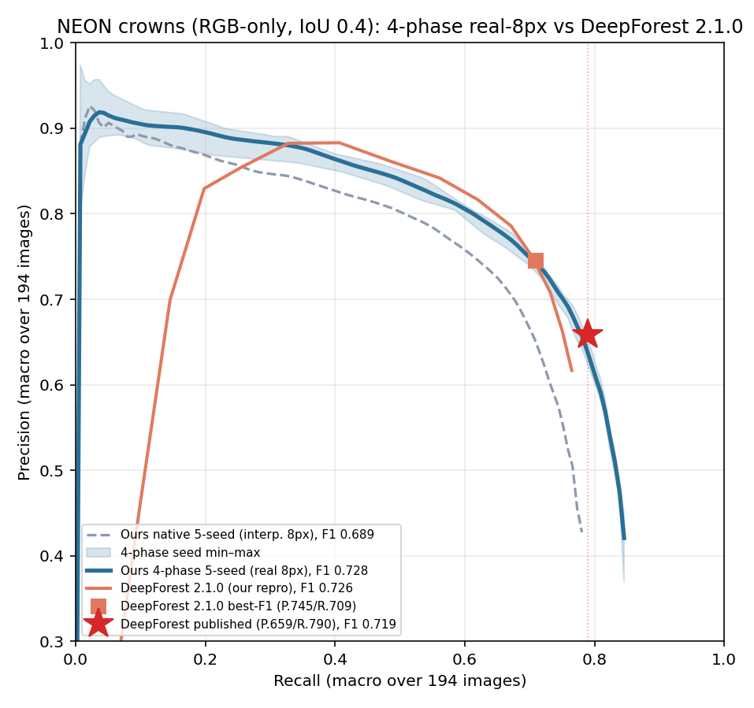

# 4-phase "center-registration" — NEON seed-0 go/no-go

**Hypothesis.** The native detector runs the frozen DINOv3-web backbone on ONE 16px patch
grid, then `DetectorS(up=2)` **bilinearly upsamples** those 16px features to an 8px grid.
That 8px grid is *interpolated* — no new sub-patch information. Here we instead run the
backbone **four times**, on the image shifted by every `(dy,dx) ∈ {0,8}px`, and
**interleave** the four 16px grids into a **real** 8px grid where each cell is filled by
the phase whose patch is centered nearest it ("pick-one", stationary). Same 4096-dim,
same targets/decode/stride-8 as native — **the only change is real-8px vs interpolated-8px
features.** Question: does that raise the recall ceiling, especially at NIWO?

Prediction from the native upscale A/B (README.md §Multiscale): NIWO's ceiling is largely
*window*-limited (2× upscale doubled NIWO maxR 0.348→0.701), and 4-phase does **not** shrink
the 16px window — so expect a *modest* NIWO lift at best. A null here means NIWO is
window-limited → pivot to **train-time upscale**. A clear lift means there was a
precision-safe *sampling* win the (precision-crashing) upscale arm masked.

## Files (all isolated in this folder)

| file | role |
|---|---|
| `phase4_features.py` | 4-phase shift + `interleave()` (pixel-unshuffle inverse) + `registration_self_test` (real-DINO abort-fast guard) |
| `phase4_lib.py` | `Detector4Phase` (= `Detector8` minus the internal interpolate) + `train_seed` (native recipe verbatim) + `predict_boxes_4p` |
| `phase4_modal.py` | Modal H100 app: `extract_4p`, `train_eval_4p` |
| `test_interleave.py` | local NO-GPU geometry test (invertibility, blob registration ≤1 cell, monotonic ordering, sub-lattice) |
| `phase4_score.py` | local apples-to-apples scoring vs native seed-0 (global-194 + NIWO-12) with `df_scorer` |

## Run

```bash
# 0) geometry test (free, no GPU)
../../.venv/bin/python phase4/test_interleave.py

# 1) 4-phase features (H100, ~15-18 min, ~$1.5) — reg-test aborts fast if interleave wrong
../../.venv/bin/modal run phase4/phase4_modal.py::extract_4p

# 2) seed-0 train + eval (H100) — writes /vol/phase4/out/preds_phase4_s0.json
../../.venv/bin/modal run phase4/phase4_modal.py::train_eval_4p

# 3) pull preds + score apples-to-apples
../../.venv/bin/modal volume get neon-multiseed-vol phase4/out/preds_phase4_s0.json phase4/out/
.venv_df/bin/python phase4/phase4_score.py
```

## RESULT — 5-seed band (2026-07-21): BEATS published DeepForest F1. Robust.

5-seed bands (seeds 0-4), `df_scorer` IoU 0.4. Cost: extract $1.5 + seed0 $2.5 +
seeds1-4 amortized $9.0 = **~$13.0** on H100.

**GLOBAL (194) — headline (best-F1, IoU 0.4):**

| model | P | R | **F1** | maxR | notes |
|---|---|---|---|---|---|
| DeepForest — **published** (Weinstein 2021, 1.8.0) | 0.659 | 0.790 | **0.719** | (0.790) | paper's reported metric, paper's eval set |
| DeepForest **2.1.0 — our repro** (best-F1) | 0.745 | 0.709 | **0.726** | — | pip pkg, deterministic, our 194 tiles |
| Ours — **native** 5-seed | 0.712 | 0.667 | 0.689 ± 0.013 | 0.779 ± 0.009 | interpolated 8px |
| Ours — **4-phase** 5-seed | 0.727 | 0.729 | **0.728 ± 0.003** | **0.849 ± 0.003** | real 8px |

Per-seed 4-phase F1: **0.722 / 0.728 / 0.729 / 0.730 / 0.730**.
- vs **published 0.719**: every seed clears it; mean−1σ = 0.725 > 0.719 → **robust beat (~3σ)**.
- vs **2.1.0 repro 0.726** (the same-194-tile apples-to-apples): 0.728 **edges it = ~tie**
  (0.726 is inside the per-seed range) → level with the *current* DeepForest package.
- vs **native 0.689**: below both DF references → the prior status quo. Δ(4ph−native) **ΔF1
  +0.039, ΔmaxR +0.070**. Caveat: published 0.719 is on the paper's own eval set; native /
  4-phase / 2.1.0-repro are all on our 194-tile reconstruction (snapshot drift).



*PR curves @IoU 0.4 (194 tiles). 4-phase (blue, seed min–max band) **dominates native**
(grey dashed) across the whole curve; it **interleaves with DeepForest 2.1.0** (orange —
4-phase better at low recall, DF 2.1.0 slightly better in the ~0.45–0.6 band) and its tail
**extends past the published DF point (★, R0.790) in recall** (maxR 0.849), sitting just
below it in precision there (P@R0.79 0.624 < 0.659). Regenerate:
`.venv_df/bin/python phase4/plot_pr.py` (per-seed curves cached in
`phase4/dl/pr_curves.json`). See [pr_curve_phase4.png](pr_curve_phase4.png).*

**NIWO (12):** 4-phase F1 **0.588 ± 0.017** vs native 0.427 ± 0.010 — Δ **F1 +0.161, R +0.196,
P +0.101, maxR +0.209** (both axes, ~10× seed σ). Precision-safe (global P held, unlike the
upscale arm's 0.731→0.523).

**Honest scope of the claim:** this is a **best-F1 summary** beat. It is **not** PR-curve
dominance at DeepForest's *published operating point* (R0.790): there our precision is
P@R0.79 = 0.624 < 0.659. 4-phase wins on *balance* (P0.727/R0.729), not by out-recalling DF
at high recall. maxR 0.849 does clear their R0.790 for the first time (native maxR 0.779
couldn't). Follow-ups to push toward curve-dominance: 2-phase fuse, mid-layer(18)×4-phase,
train-time upscale (window lever).

## Design notes / correctness

- **Registration.** Encode/decode are byte-identical to native (`TargetConfig(grid=64,
  stride=8)`), so the comparison is purely feature quality. The assembled cell `X` sits at
  patch-center pixel `8X+8` vs the target cell center `8X+4` — a uniform **half-cell**
  offset absorbed by the offset head (init bias 0.5), exactly as native absorbs its own
  interpolation offset. Verified: `test_interleave.py` blob test ≤1 cell across 200 spots;
  real-DINO `reg-test` shows invertibility (maxabs ~2e-4 fp16) and real≠interp cos≈0.955.
- **Edge.** An 8px shift zero-fills a ≤8px top/left strip; NEON 400px tiles have ≥112px
  bottom-right pad so this is lossless there, and the pad region is dropped at eval anyway.
- **Cost.** Extract (one-time) ~$1.5; seed-0 train+eval ~$1.5–3 → total ≈ **$3–4.5** on
  H100. `train_eval_4p` prints a live `est_cost_usd` from wall-time.

## Cleanup (risk-free — nothing shared is modified)

```bash
rm -rf phase4/                                   # this whole folder
../../.venv/bin/modal volume rm neon-multiseed-vol phase4   # the /vol/phase4 subtree
```
No native file, default, or Volume input is touched — the native pipeline is unaffected.
